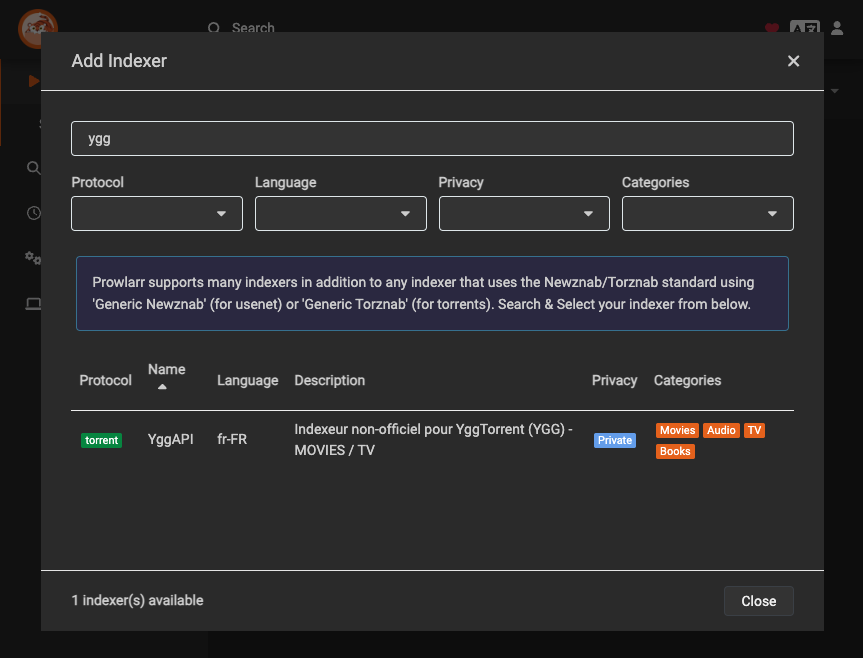

# Prowlarr with YGG-API Indexer

[](https://github.com/almottier/prowlarr-ygg/actions/workflows/auto-rebuild.yml)

An up-to-date Prowlarr Docker image with the YGG-API indexer pre-installed for YGGTorrent support.

```text
ghcr.io/almottier/prowlarr-ygg
```

## Features

- Based on the latest [hotio/prowlarr](https://hotio.dev/containers/prowlarr/) image
- [YGG-API indexer](https://gist.github.com/Clemv95/8bfded23ef23ec78f6678896f42a2b60) using [yggapi](https://yggapi.eu/) pre-installed in `/config/Definitions/Custom/`
- Automatically rebuilds when the base image or the YGG-API indexer is updated
- Ready to use after container startup

## Usage

### cli

```bash
docker run --rm \
    --name prowlarr \
    -p 9696:9696 \
    -e PUID=1000 \
    -e PGID=1000 \
    -e UMASK=002 \
    -e TZ="Europe/Paris" \
    -v /<host_folder_config>:/config \
    ghcr.io/almottier/prowlarr-ygg
```

### compose

```yaml
services:
  prowlarr:
    container_name: prowlarr
    image: ghcr.io/almottier/prowlarr-ygg
    ports:
      - "9696:9696"
    environment:
      - PUID=1000
      - PGID=1000
      - UMASK=002
      - TZ=Europe/Paris
    volumes:
      - /<host_folder_config>:/config
```

## Configuration

After starting the container, the YGG-API indexer will be available in Prowlarr's indexer settings:


